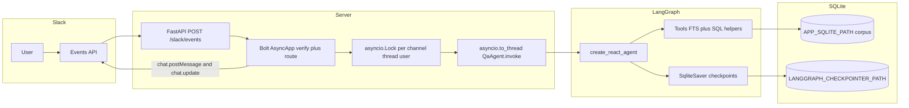

# Design notes (how I actually built this)

I wrote this myself—no boilerplate from a template pasted in verbatim. It is how I think about the system after living in it for a while.

## What I was trying to solve

I needed a Slack bot that answers questions **only** from the take-home SQLite database. I did not want a chatty model that “kind of remembers” your product; I wanted something closer to **an analyst with read-only access to one warehouse**. If the row is not there, the bot should say so.

I also cared about **multi-turn** conversations in a single Slack thread, and about **not** spamming the channel with ten partial messages. The assignment pushed on security, agent quality, and UX without streaming—I took that seriously rather than treating it as a checkbox.

## Architecture (the path a message takes)

Slack hits **`POST /slack/events`** on a small FastAPI app. I kept **`/healthz`** separate so I would not confuse Slack URL verification with health checks again (I did that once early on; it was dumb in hindsight).

Inside FastAPI I use **Slack Bolt’s async stack**: `AsyncApp` with the signing secret, and `AsyncSlackRequestHandler` to turn the Starlette/FastAPI request into something Bolt understands. I like that I am not reimplementing HMAC verification—I would probably get it subtly wrong.

**Routing** is something I fought with for a bit. I ended up with:

- **`app_mention`** for channel mentions (`@bot …`). That is the main demo path.
- **`message`** only when `channel_type == "im"` for DMs.

If I handle channel text in both handlers, Slack can fire twice and users see **duplicate replies**. Splitting it this way felt ugly at first, but it is the fix that actually worked.

The handler posts a **“Working on it…”** message, then runs the LangGraph agent in **`asyncio.to_thread`** so the event loop stays responsive. I wrap that in **`asyncio.wait_for`** (75 seconds) because I do not want a stuck model call to hold the worker forever. When the answer is ready, I **`chat_update`** that same message so the thread stays clean; if Slack rejects the update for whatever reason, I fall back to **`chat_postMessage`**.

I also added a **delayed progress line** (after ~8 seconds) that updates the placeholder text. It is not magic—it is just UX honesty when retrieval takes longer than people expect.

When my brain gets fuzzy I draw the box diagram below. GitHub renders Mermaid in the markdown preview; if you are reading this somewhere that does not, you still have the prose above.

## Why LangGraph (and what I actually used)

I used **`create_react_agent`** from LangGraph’s prebuilt module: a **ReAct-style** loop where the model can call tools, read results, and iterate. I did not build a custom state machine from scratch; I felt like the assignment was about **grounding and integration**, not about reinventing a planner DSL.

Persistence matters for multi-turn chat. I wired in **`SqliteSaver`** from `langgraph-checkpoint-sqlite` against a **separate** SQLite file from the business database. That way conversation checkpoints do not live in the same file as `customers` / `artifacts`. Each Slack conversation gets a **`thread_id`** I derived as `channel:thread_ts:user` so threads do not bleed into each other when multiple people talk.

I pass a **`recursion_limit`** tied to config (default 24) so a bad day in tool-calling does not recurse forever. Temperature is **0** on the chat model—I wanted answers to feel boring and factual rather than creative.

## Data layer and grounding

I could have exposed only `run_sql`, but in practice the model wanders. I added **higher-level tools** so the agent has a beaten path:

- **`find_customers`** with fuzzy-ish scoring on names and metadata.
- **`get_customer_artifacts`** after narrowing a customer.
- **`filter_artifacts`** when the question is basically “find rows where all these strings appear.”
- **`find_customer_by_issue_signals`** when the prompt is “which customer” plus an **exact date** plus keywords—that pattern shows up a lot in eval-style questions.
- **`search_artifacts`** using SQLite FTS (`MATCH`, BM25 ordering) for keyword-ish search.
- **`describe_table` / `list_tables`** for orientation.
- **`run_sql`** last, for ad hoc SELECTs when nothing else fits.

For **`run_sql`** I went heavy on guardrails: read-only URI, `PRAGMA query_only`, SELECT-only parsing, no multi-statement, no SQL comments, length limits, row caps, and a **SQLite progress handler** so runaway queries get interrupted. I feel a little paranoid about SQL injection from the model itself, but I would rather be paranoid than sorry.

The system prompt pushes a pattern: **resolve entity → pull artifacts → narrow with SQL if needed → answer**. I also tell the model not to invent dates and to prefer evidence from tools.

### Something I should be upfront about

For a narrow family of questions (proof-plan / renewal language tied to **2026-02-20**), I added a **small deterministic post-pass** in Python that can re-query SQLite and **append** missing proof criteria if the model’s answer is thin. I feel conflicted about that—it is not “pure” end-to-end LLM magic—but evals were chewing me up on missing phrases like “7–10 business day” and “top 20 saved searches,” and I wanted the demo to reflect what is **in the database** even when the summarizer drops a detail. If I had more time I would try to fix that with better prompting or a retrieval pass instead of special-casing a date.

## Security and auth

**Slack:** Bolt verifies the signing secret on inbound events. I optionally support **`SLACK_ALLOWED_TEAM_ID`** so if I ever reused credentials across workspaces I would still drop events from the wrong `team` id. Tokens and secrets live in **environment variables** (`.env` locally); they never go to the client.

**OpenAI:** The key is server-side only. Slack users never see it.

**Outbound Slack:** I set the async web client with **`proxy=None`** and **`trust_env_in_session=False`**. I lost an afternoon once to a localhost proxy injected via env vars—Slack events arrived fine but posting messages failed. That fix felt silly when I found it, but it mattered.

## Threading, locks, and “did Slack send this twice?”

I keep an **`asyncio.Lock` per conversation key** so two rapid messages in the same thread do not interleave two generations and produce a race on which answer wins.

Slack retries events. I track a short TTL map on `channel:user:event_ts` to **suppress duplicates** without standing up Redis. For a real production service I would want something shared across instances; for a single-node demo this felt honest.

## UX choices (no streaming)

I am not streaming tokens to Slack. Instead you get a **single edited message** that upgrades from “working” to the final answer. I like how that reads in a busy channel—it does not feel like a terminal tailing a log file.

## Performance and how I measure it

The agent path logs **latency_ms** and **tool_calls** per answer. Individual tools log their own latency and rough row counts. That helped me see when I was paying for too many round trips.

I wrote **`scripts/eval_queries.py`** with a handful of nasty questions and **required substring checks**—not perfect, but fast feedback when I changed prompts or models. I treat pass rate and average score as directional, not as proof the bot is “smart.”

Bottlenecks I expect: **LLM latency**, then **too many tool hops** if the model thrashes. If I continued, I would add caching for repeated `describe_table` calls and maybe a “retrieve top-k chunks then answer” path for long artifact text.

## What I would do next

- Shared idempotency store if I ever run **more than one** uvicorn worker.
- Structured logging (JSON) and trace ids from Slack `event_id` through tool calls.
- Tighter retrieval: embeddings or chunking—only if the assignment scope grew; right now FTS plus excerpts was the pragmatic middle ground.
- Rewrite the proof-plan post-pass into a **general** “answer must cite required spans” step instead of a date-tied hack.

## Closing thought

I built this as **a thin production wrapper around a grounded agent**. The interesting parts to me are where **Slack reality** (retries, threading, message updates) meets **database reality** (read-only, capped rows) meets **model reality** (it will forget a phrase unless you force the evidence in front of it). I feel like I learned the most in those seams—not in picking LangGraph over another framework name.
